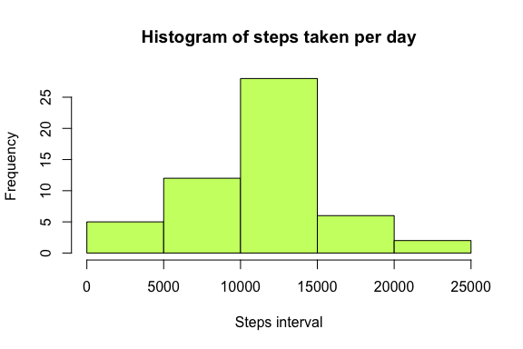
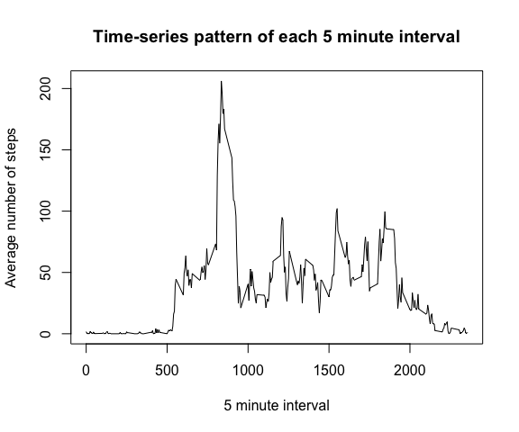
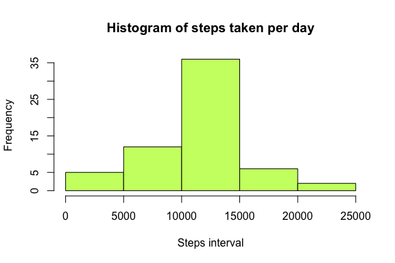
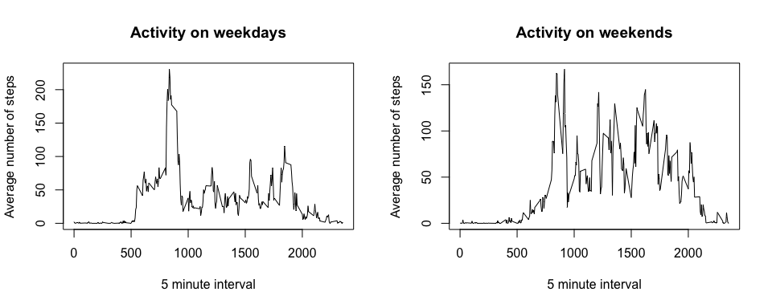

# Reproducible Research: Peer Assessment 1
Oscar Peña del Rio  


## Loading and preprocessing the data

Uses the unzip() function to extract the CSV file and loads it into **activity_data** dataframe.


```r
unzipped_file <- unzip("activity.zip")
activity_data <- read.csv(unzipped_file)
```

## What is mean total number of steps taken per day?

1. Calculate the total number of steps taken per day, omitting *NA* values. Generate histogram with the values.


```r
steps_by_date <- aggregate(steps ~ date, activity_data, sum, na.action = na.omit)
hist(steps_by_date$steps,
     main="Histogram of steps taken per day",
     xlab="Steps interval",
     col="darkolivegreen1"
)
```

 

2. Calculate and report the mean and median of the total number of steps taken per day


```r
mean(steps_by_date$steps)
```

```
## [1] 10766.19
```

```r
median(steps_by_date$steps)
```

```
## [1] 10765
```

## What is the average daily activity pattern?

1. Make a time series plot of the 5-minute interval (x-axis) and the average number of steps taken, averaged across all days (y-axis).


```r
steps_by_interval <- aggregate(steps ~ interval, activity_data, mean, na.action = na.omit)
plot(steps_by_interval$interval, steps_by_interval$steps, 
     type="l",
     main="Time-series pattern of each 5 minute interval",
     xlab="5 minute interval",
     ylab="Average number of steps"
)
```

 

2. 5-minute interval, on average across all the days in the dataset, which contains the maximum number of steps


```r
steps_by_interval[steps_by_interval$steps==max(steps_by_interval$steps),]
```

```
##     interval    steps
## 104      835 206.1698
```

## Imputing missing values

1. Calculate and report the total number of missing values in the dataset


```r
sum(is.na(activity_data$steps))
```

```
## [1] 2304
```

2. Create a new dataset that is equal to the original dataset but with the missing data filled in.


```r
steps_data <- data.frame(activity_data$steps)
steps_data[is.na(steps_data),] <- ceiling(tapply(activity_data$steps, activity_data$interval, mean, na.rm=TRUE))
filled_activity_data <- cbind(steps_data, activity_data[,2:3])
```

3. Make a histogram of the total number of steps taken each day.


```r
filled_steps_by_date <- aggregate(activity_data.steps ~ date, filled_activity_data, sum)
hist(filled_steps_by_date$activity_data.steps,
     main="Histogram of steps taken per day",
     xlab="Steps interval",
     col="darkolivegreen1"
)
```

 

4. Calculate and report the mean and median total number of steps taken per day.


```r
mean(filled_steps_by_date$activity_data.steps)
```

```
## [1] 10784.92
```

```r
median(filled_steps_by_date$activity_data.steps)
```

```
## [1] 10909
```

The **mean** and the **median** are quite similar in both cases (that is, with the original data and after the simple *NA* values removal step), so its impact can be considered low.

## Are there differences in activity patterns between weekdays and weekends?

1. Create a new factor variable in the dataset with two levels – “weekday” and “weekend” indicating whether a given date is a weekday or weekend day.


```r
determine_date_type <- data.frame(sapply(filled_activity_data$date, function(day) {
    if (weekdays(as.Date(day)) %in% c("Monday", "Tuesday", "Wednesday", "Thursday", "Friday")) {
        day <- "weekday"
    }
    else {
        day <- "weekend"
    } 
}))

filled_activity_data_with_date_type <- cbind(filled_activity_data, determine_date_type)
colnames(filled_activity_data_with_date_type) <- c("steps", "date", "interval", "date_type")
```

2. Make a panel plot containing a time series plot of the 5 minute interval (x-axis) and the average number of steps taken, averaged across all weekday days or weekend days (y-axis).


```r
filled_date_type_steps_by_date_weekend <- subset(filled_activity_data_with_date_type, date_type == "weekend") 
filled_date_type_steps_by_date_weekday <- subset(filled_activity_data_with_date_type, date_type == "weekday") 

filled_date_type_steps_by_date_weekend <-tapply(filled_date_type_steps_by_date_weekend$steps, filled_date_type_steps_by_date_weekend$interval, mean)
filled_date_type_steps_by_date_weekday <-tapply(filled_date_type_steps_by_date_weekday$steps, filled_date_type_steps_by_date_weekday$interval, mean)

par(mfrow=c(1,2))

plot(
    x = names(filled_date_type_steps_by_date_weekday),
    y = filled_date_type_steps_by_date_weekday,
    type = "l",
    main = "Activity on weekdays",
    xlab = "5 minute interval",
    ylab = "Average number of steps"
)

plot(
    y = filled_date_type_steps_by_date_weekend,
    x = names(filled_date_type_steps_by_date_weekend),
    type = "l",
    main = "Activity on weekends",
    xlab = "5 minute interval",
    ylab = "Average number of steps"
)
```

 
